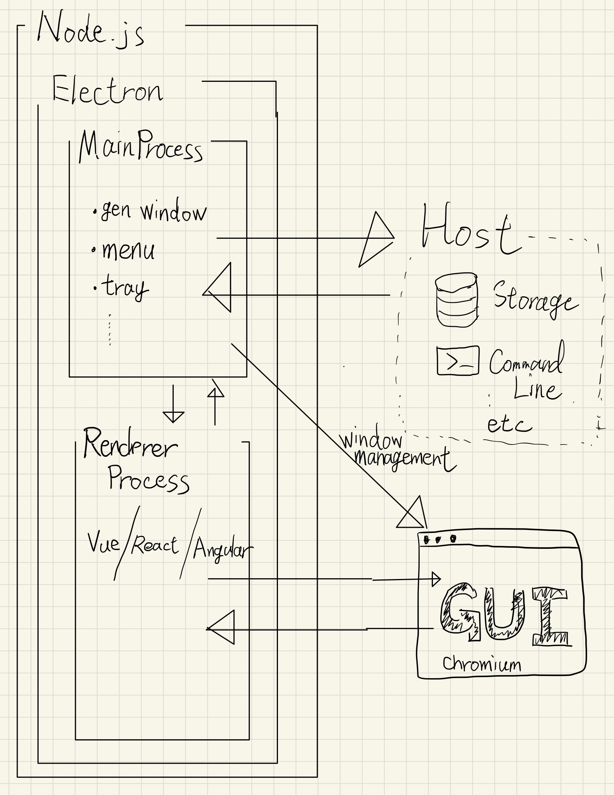

<!--
_class: lead
_paginate: false
_header: ""
_footer: ""
-->

# Electron を触って

# Desktop アプリについて考えた

### 2021/08/11 Sugiyama

---

# Electron とは? (1)

- デスクトップアプリケーション開発フレームワーク
- クロスプラットフォーム
  - Windows
  - macOS
  - Linux
- 開発元は Github
  - github.com/electron/electron

---

# Electron とは? (2)

- 公式事例集: electronjs.org/apps
  - Atom
    - もともと Electron は Atom を開発するためのフレームワーク
  - Visual Studio Code
  - Slack
  - Skype
  - GitKraken

---

# Electron とは? (3)

- 公式には載ってないけど Electron 使用
  - Authy
  - Trello
  - WorkFlowy
  - Docker GUI

---

# なぜデスクトップアプリなのか？(1)

##### (= なにが Web アプリでは難しいのか？)

- 動くものがホスト PC にあるので起動・動作が早い
  - ユーザーが、目当てのものにすぐアクセスできる
    - Authy
- ホストに対してできることが多い
  - ローカルのファイルシステムへの読み書き
    - Visual Studio Code 　(ディレクトリ単位での管理)
  - コマンドの実行
    - GitKraken (git init, git clone, etc...)

---

# なぜデスクトップアプリなのか？(2)

##### (= なにが Web アプリでは難しいのか？)

- バックグラウンドでプロセスが持てる
  - Slack(開いてなくても通知が受け取れる)

---

# Web アプリの方が強い点

- インストール不要
- アップデートが早い(ユーザーにアップグレードを促す必要がない)

---

<!-- _class: lead -->

### PWA...(あまり言及しない)

---

<!-- _class: lead -->

# ここで Electron の話に戻って...

---

# Electron の中身

- Node.js
  - メインプロセス (サーバサイド js 相当)
    - ホストを操作できる
    - ウィンドウを管理する
  - レンダラプロセス (Web フロント相当)
    - Chromium
    - 複数存在しうる

---

# 何を作ればデスクトップアプリとしての価値を出せるのか？

##### (最大の課題)

- Web アプリにはちょっと実現できない機能を実装する
  - ホストのストレージ上のファイルを管理する
  - コマンドラインをラップする
  - Tray(常に目に付く場所)で何かを常に(有意義なことを)表示する
  - ホスト側でしかできない煩雑な操作を代行する

---

<!-- _class: lead -->

### "何か"をつくった

---

## <!-- ### (何かって何を？......) -->

## `SBM`: macセットアップ支援アプリ の空想(1)

- カスタマイズの面倒な調整を解消する
  - いわゆる`Preferences`
    - Dock の位置/Autohide
    - ダークモード/ライトモード
    - マウスカーソルの速さ
    - 外部ディスプレイとの位置関係
  - ~/.zshrc の内容
  - Homebrew の利用状況

---

## `SBM`: macセットアップ支援アプリ の空想(2)

- 想定
  - 普段の PC に予め SBM をインストールしておく
  - 新しい PC を手に入れたら早めに SBM をインストールする
- 何をするのか
  - macOS の設定変更を監視
  - macOS の設定内容を YAML などの設定ファイルに常にエクスポート
  - 設定ファイルはローカルの git リポジトリで管理
  - 設定ファイルをインポートし即座に新しい macOS に適用する

---

# やりたかったけどできなかった

- レンダラプロセスで Vue.js/React を用いて描画
- 開発環境
  - 仮想化
  - ホットリロード
- 各種テスト

---

# 感想

- Electron でいろいろできそうではある
- 意義のあることを発想するのは難しい
- 自分 Node.js 全然知らないなと思った
  - TypeScript に移行するのが意外としんどかった

---

<!--
_class: lead
_paginate: false
_header: ""
_footer: ""
-->

# おわり

---

# 次はこれをやりたい

- 続・SBM をつくる
- 個人主義な TODO アプリをつくる
- 麻雀点箱アプリをつくる
- リモートクリップボードアプリをつくる
- Ethereum でなにかする
- ICP(Internet Computer Protocol)でなにかする
- (Marp でもう少し`らしい`スライドを作ってみる)

---

<!--
_class: lead
_paginate: false
_header: ""
_footer: ""
-->

# 本当におわり
